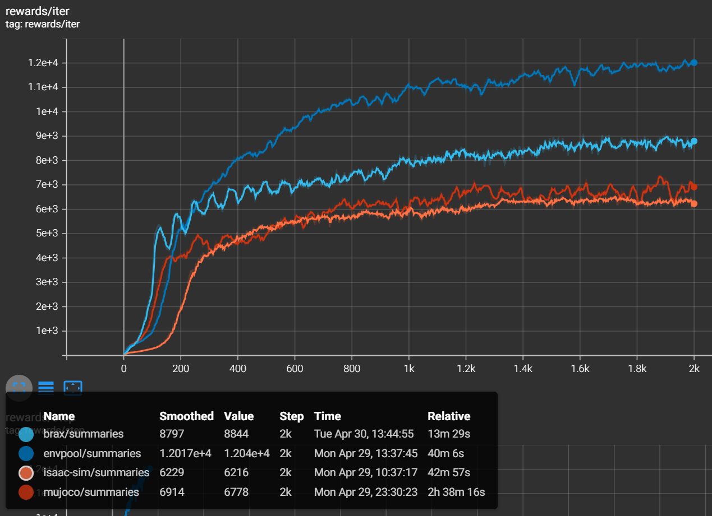
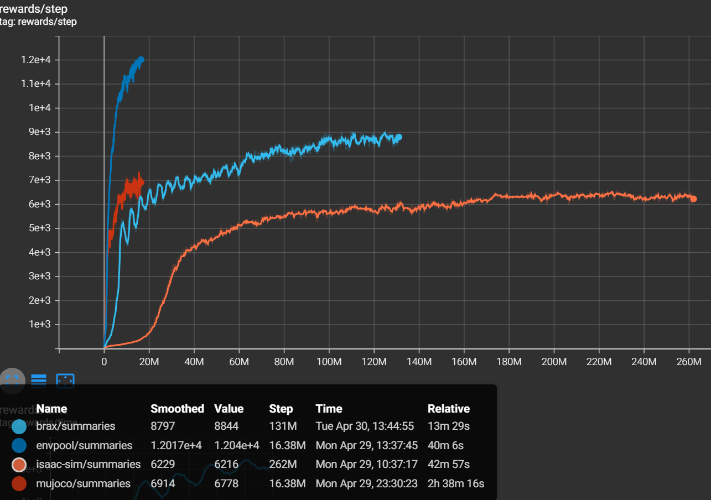

# Physics Simulators

Reinforcement Learning tutorial for physics-based environments:
- MuJoCo gym
- MuJoCo envpool
- MuJoCo XLA (brax)
- Isaac Sim

Train policies for MuJoCo gym, MuJoCo envpool, and brax using forked version of [rl_games](https://github.com/yurangja99/rl_games.git). 

Train policies for Isaac Sim using [OmniIsaacGymEnvs](https://github.com/NVIDIA-Omniverse/OmniIsaacGymEnvs.git)

## Start using Docker
How to run this repository is described in [`DOCKER.md`](./DOCKER.md). 

## Trained checkpoints
Simple MLP policies are trained by PPO algorithm for `Humanoid` environment provided by (1) MuJoco, (2) MuJoCo envpool, (3) brax, and (4) Isaac Sim. 

Each agent is trained 2000 iterations using RTX 3090 GPU. 
Each agent has trained different number of steps on another, so we have to consider it when comparing them. 



The graph shows the learning curve of four agents. 
It seems that envpool, brax, and isaac sim took same time to be trained, but see another graph below. 



Envpool, brax, and isaac sim took similar time, but they are trained significantly different steps. 
Normalized time to be trained 100M steps are calculated as below. 
Brax performs the best, isaac sim is second, then envpool is third. 

||mujoco|envpool|brax|isaac-sim|
|-|-|-|-|-|
|time to train 2000 iters (num of steps)|158 min|40 min|13.5 min|43 min|
|time to train 100M steps|964.6 min|244.2 min|10.3 min|16.4 min|
|speedup from mujoco|1.0|3.95|93.65|58.8|

You can run trained checkpoints for each simulator, but first you have to set environment following the [instruction](#start-using-docker). 

After setting environment, you can play the policies. If you want rendering of the rollouts, set `params.config.player.render` in the config file. 

```bash
# play trained policy in mujoco gym
cd /workspace/physics-simulators/rl_games
poetry run python runner.py --play --file rl_games/configs/mujoco/humanoid.yaml --checkpoint ../results/Humanoid/mujoco/nn/Humanoid-v4_ray.pth

# play trained policy in mujoco envpool
cd /workspace/physics-simulators/rl_games
poetry run python runner.py --play --file rl_games/configs/mujoco/humanoid_envpool.yaml --checkpoint ../results/Humanoid/envpool/nn/Humanoid-v4_envpool.pth

# play trained policy in brax
cd /workspace/physics-simulators/rl_games
poetry run python runner.py --play --file rl_games/configs/brax/ppo_humanoid.yaml --checkpoint ../results/Humanoid/brax/nn/Humanoid_brax.pth

# play trained policy in isaac sim
cd /workspace/physics-simulators/OmniIsaacGymEnvs/omniisaacgymenvs
sudo /isaac-sim/python.sh scripts/rlgames_train.py task=Humanoid headless=True test=True num_envs=64 checkpoint=../../results/Humanoid/isaac-sim/nn/Humanoid.pth
```

Average reward of trained policies are:

||MuJoCo Gym|MuJoCo Envpool|Brax|Isaac Sim|
|-|-|-|-|-|
|Training Time (hours)|33|8|1|7.75|
|Test Episodes|2000|2000|2076|1944|
|Average Test Reward|8230.41|11791.60|8999.30|8668.70|
|Average Test Steps|935.26|958.99|965.31|976.45|
